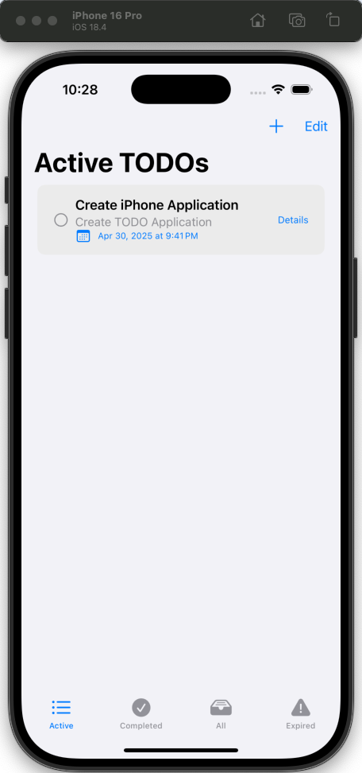

# ManageTodo

ManageTodo is a simple and intuitive todo management application built with SwiftUI for iOS devices.

## Features

- Create, edit, and delete todo items
- Mark todos as complete
- Clean and modern user interface
- Persistent storage of todo items

## Requirements

- iOS 15.0+
- Xcode 13.0+
- Swift 5.5+

## Installation

1. Clone the repository
```bash
git clone https://github.com/yourusername/ManageTodo.git
```

2. Open the project in Xcode
```bash
cd ManageTodo
open ManageTodo.xcodeproj
```

3. Build and run the project in Xcode

## Project Structure

- `ManageTodoApp.swift`: Main application entry point
- `ContentView.swift`: Main view of the application
- `TodoListView.swift`: View for displaying the list of todos
- `TodoFormView.swift`: View for creating and editing todos
- `TodoViewModel.swift`: ViewModel handling todo data and business logic
- `TodoItem.swift`: Model representing a todo item
- `AppIconView.swift`: Custom app icon view

## Architecture

The application follows the MVVM (Model-View-ViewModel) architecture pattern:
- **Model**: `TodoItem` represents the data structure
- **View**: SwiftUI views (`ContentView`, `TodoListView`, `TodoFormView`)
- **ViewModel**: `TodoViewModel` manages the business logic and data

## License

This project is licensed under the MIT License - see the LICENSE file for details.

## Contributing

Contributions are welcome! Please feel free to submit a Pull Request.

## screenshot


